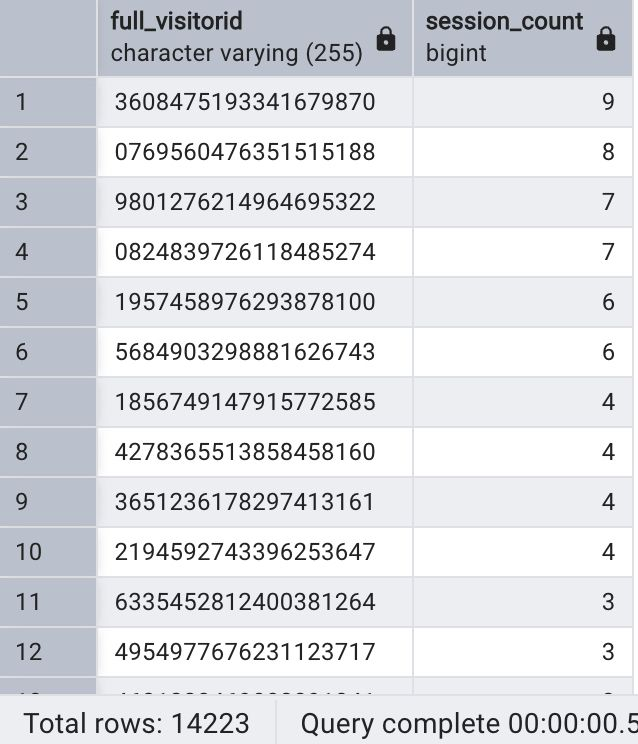

## Question 1
> What products did visitors look at btw November 2016 and December 2016 and were ordered, and how many times was the product viewed in total, as well as the amount of time spent looking at each product?
  

SQL Queries:
```sql
SELECT v2_productname, 
	SUM(total_ordered) AS total_orders, 
	SUM(als.pageviews) AS page_views, 
	SUM(als.time_on_site) AS time_on_site
FROM all_sessions als
JOIN sales_by_sku sbs
ON als.product_sku = sbs.product_sku
WHERE sbs.total_ordered <> 0 
	AND city <> 'not available in demo dataset' 
	AND city <> '(not set)'
	AND country <>'(not set)'
	AND (date BETWEEN '2016-11-01' AND '2016-12-31')
	AND time_on_site IS NOT NULL
GROUP BY v2_productname
ORDER BY page_views DESC
LIMIT 10;
```

### :heavy_check_mark: Answer


## Question 2
>  find the total number of unique visitors (`fullVisitorID`)

SQL Queries:
```sql
CREATE TEMP TABLE new_table AS
	SELECT distinct als.full_visitorid AS als_fullvisitorid, a.full_visitorid AS af_fullvisitorid
	FROM all_sessions als
	FULL OUTER JOIN analytics a
	ON a.visitid = als.visitid;

SELECT COUNT(*)
FROM
	(SELECT als_fullvisitorid
	FROM new_table
	WHERE als_fullvisitorid IS NOT NULL
	UNION
	SELECT af_fullvisitorid
	FROM new_table
	WHERE af_fullvisitorid IS NOT NULL) AS all_unique_visitors;
```

### :heavy_check_mark: Answer


## Question 3
> Find each unique product viewed by each visitor

SQL Queries:

```sql
SELECT distinct full_visitorid, v2_productname  
FROM all_sessions
WHERE v2_productname IS NOT NULL;
```

### :heavy_check_mark: Answer


## Question 4 
> Which products had the highest number of views?

SQL Queries:
```sql
SELECT v2_productname, COUNT(*) AS views
FROM all_sessions
WHERE v2_productname IS NOT NULL
GROUP BY v2_productname
ORDER BY views DESC
LIMIT 10;
```

### :heavy_check_mark: Answer


## Question 5
> How many sessions did each visitor have?

SQL Queries:
```SQL
SELECT full_visitorid, COUNT(DISTINCT visitid) AS session_count
FROM all_sessions
GROUP BY full_visitorid
ORDER BY session_count DESC
```

### :heavy_check_mark: Answer

