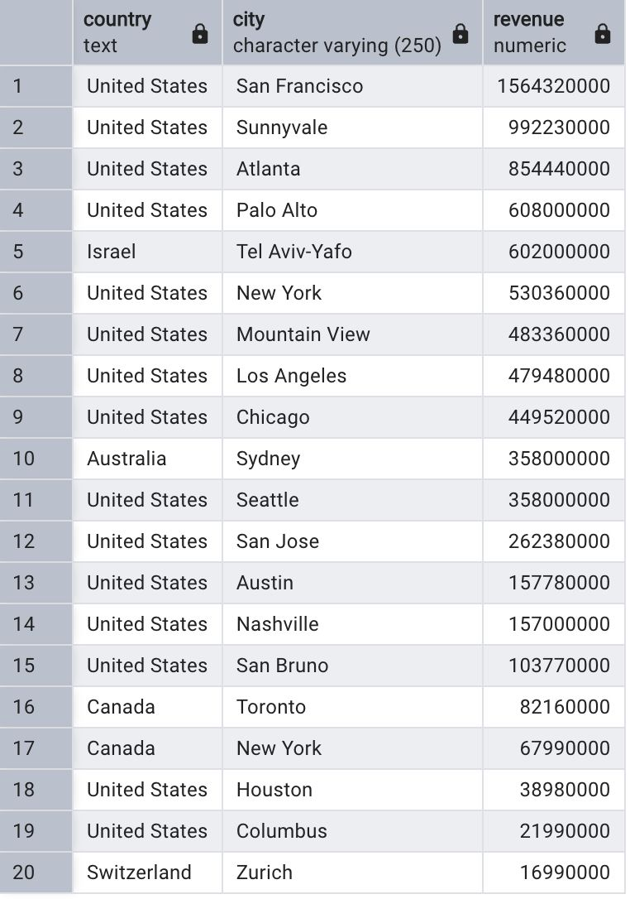

    
## Question 1
> Which cities and countries have the highest level of transaction revenues on the site?


```SQL
SQL Queries:
SELECT country, city, SUM(total_transaction_revenue) AS revenue  
FROM all_sessions
WHERE city != 'not available in demo dataset' 
	AND total_transaction_revenue IS NOT NULL
GROUP BY country, city
ORDER BY revenue DESC
```


### :heavy_check_mark: Answer




**Question 2: What is the average number of products ordered from visitors in each city and country?**


SQL Queries:
```SQL
SELECT city, country, ROUND(AVG(sbs.total_ordered)) AS average_number_of_products
FROM all_sessions als
JOIN sales_by_sku sbs
ON als.product_sku = sbs.product_sku
WHERE sbs.total_ordered <> 0 
	AND city <> 'not available in demo dataset' 
	AND city <> '(not set)'
	AND country <>'(not set)'
GROUP BY city, country 	
ORDER BY average_number_of_products DESC

```


### :heavy_check_mark: Answer


## Question 3 
> Is there any pattern in the types (product categories) of products ordered from visitors in each city and country?


SQL Queries:
```SQL
-- products that were ordered by visitors
CREATE TEMP TABLE total_products_ordered AS
	SELECT als.product_sku, v2_productcategory, total_ordered, city, country
	FROM all_sessions als
	JOIN sales_by_sku sbs
	ON als.product_sku = sbs.product_sku
	WHERE sbs.total_ordered <> 0 
		AND city <> 'not available in demo dataset' 
		AND city <> '(not set)'
		AND country <>'(not set)'
	ORDER BY total_ordered DESC;

-- to view each category
-- Almost every order is from the home category 
SELECT product_sku, v2_productcategory, total_ordered, city, country
FROM total_products_ordered
WHERE v2_productcategory LIKE '%Home%' 


```


### :heavy_check_mark: Answer


**Question 4: What is the top-selling product from each city/country? Can we find any pattern worthy of noting in the products sold?**


SQL Queries:
```SQL
SELECT v2_productname, country, SUM(total_ordered) AS total_orders
FROM (
	SELECT als.product_sku, v2_productname, city, country, total_ordered
	FROM all_sessions als
	JOIN sales_by_sku sbs
	ON als.product_sku = sbs.product_sku
	WHERE sbs.total_ordered <> 0 
		AND city <> 'not available in demo dataset' 
		AND city <> '(not set)'
		AND country <>'(not set)'
	)
GROUP BY v2_productname, country
ORDER BY total_orders DESC
```


### :heavy_check_mark: Answer

```sql
SELECT 
  country,
  city,
  SUM(total_transaction_revenue) AS total_revenue,
  ROUND(
    100.0 * SUM(total_transaction_revenue) / SUM(SUM(total_transaction_revenue)) OVER (), 
    2
  ) AS revenue_percent
FROM 
  all_sessions
WHERE city != 'not available in demo dataset' 
	AND total_transaction_revenue IS NOT NULL
GROUP BY 
  country, city
ORDER BY 
  total_revenue DESC;

```


**Question 5: Can we summarize the impact of revenue generated from each city/country?**

SQL Queries:


### :heavy_check_mark: Answer


